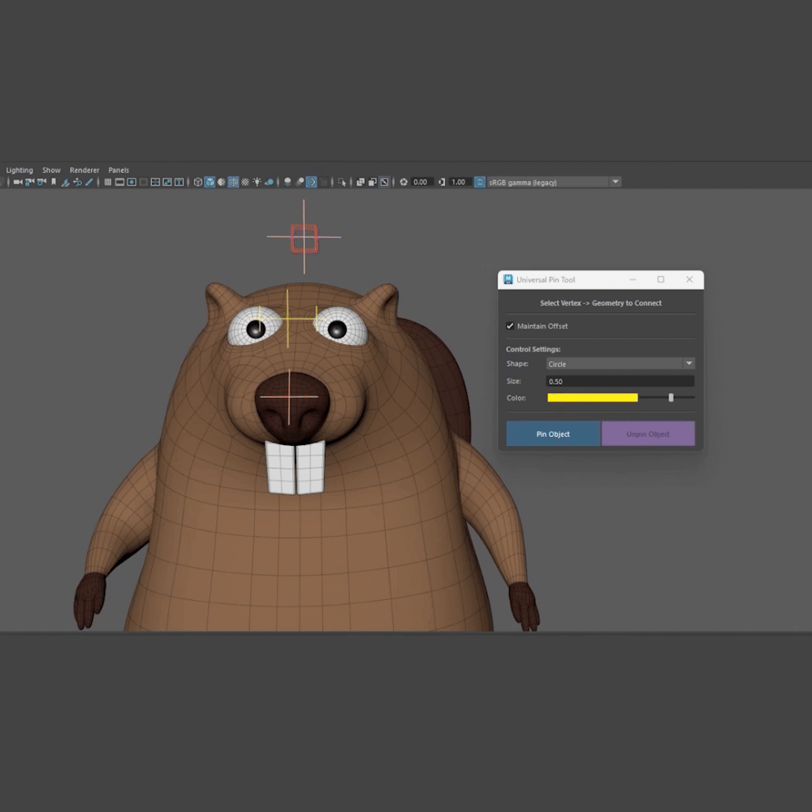
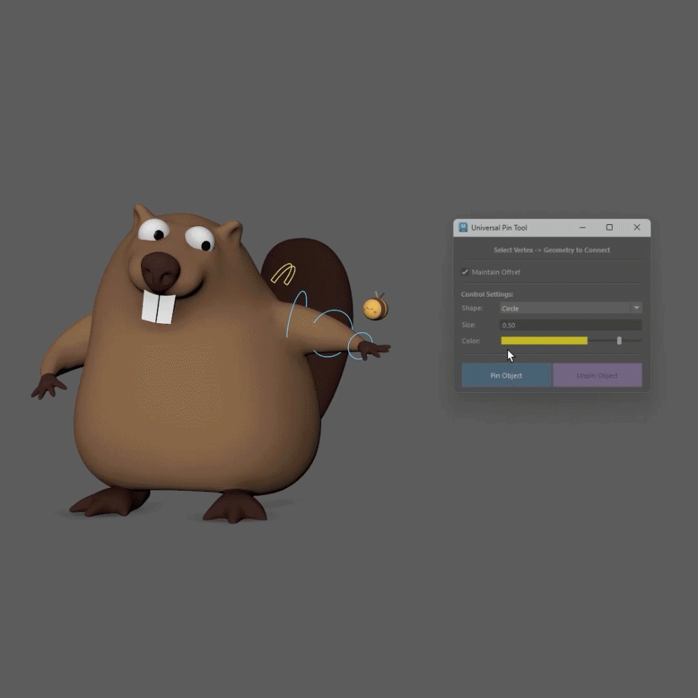

# Universal Pin Tool

**Version:** 1.0 (2026)  
**License:** MIT (Free for educational, personal and commercial projects. If you use it, a credit is always appreciated.)  
**Gumroad:** [Download for Free on Gumroad](https://yafarba.gumroad.com/l/universal-pin-tool)





---

## 🛠️ Requirements

*   **Autodesk Maya:** 2022 / 2023 / 2024 / 2025 / 2026+ (Python 3)

---

## 📝 Description

This script creates a sticky rig that attaches a geometry object to a mesh vertex. It uses the uvPin node to connect the object to the selected vertex, then automatically builds the controls, hierarchy, pivots and skinning needed for the setup. The rig can be easily removed at any time with the Unpin Object button.

---

## ⚠️ Important Note

### Maintain Offset behavior:

*   **Enable (ON)** -> Keeps the geometry in its current position.
*   **Disable (OFF)** -> Snaps the geometry to the selected vertex.

---

## 🚀 Installation and Launch Instructions

### Option 1: Run via Maya Scripts Folder (Recommended)

1. Copy the `universal_pin_tool.py` file into your Maya scripts directory:
   * **Windows:** `Documents\maya\<version>\scripts\`
   * **macOS:** `/Users/<username>/Library/Preferences/Autodesk/maya/<version>/scripts/`
   * **Linux:** `~/maya/<version>/scripts/`

2. Open Maya, navigate to the **Script Editor**, and open a **PYTHON** tab.
3. Paste and execute the following code:

```python
import universal_pin_tool
tool = universal_pin_tool.UniversalPinTool()
tool.create_pin_tool_ui()
```

4. *(Optional)* Highlight this code in the Script Editor and middle-mouse drag it onto your **Shelf** to create a quick-access button.

### Option 2: Drag & Drop (Easiest)

1. Open Maya.
2. Drag the `universal_pin_tool.py` file from your file explorer.
3. Drop it directly into the Maya Viewport. The UI will open automatically.

---

## 🛠️ How To Use

1. Select exactly 1 mesh vertex on your base geometry.
2. Shift/Ctrl-select exactly 1 geometry transform (the object you want to pin).
3. Set your Maintain Offset preference, control shape, size and color.
4. Click the **Pin Object** button.
5. Select the pinned geometry or its _Pin_CTRL node, then click **Unpin Object** to remove the rig.
6. Enjoy! 😊
